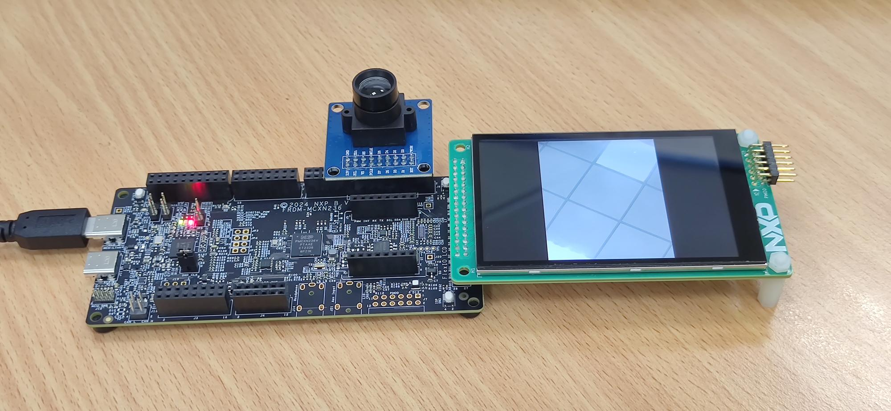
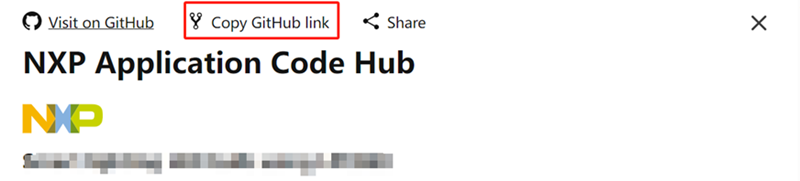

# NXP Application Code Hub

## Using SmartDMA to implement camera interface in MCXN236

Using SmartDMA to implement camera interface in MCXN236.
This demo introduces a parallel interface for the camera solution for MCXN236.

The camera interface can be used as important part of camera usage as below:

• Object detection

• Gesture recognition

• Color recognition

• QR code scanning, and so on.

Supported formats (8-bit): RGB565

• Maximum image transfer rate: 30 fps for QVGA(320 × 240). For small RAM parts, reduce the size of image and frame
rate.

• Camera module tested: OV7670

• Other camera modules can be supported as long as they provide the same signal timing.

#### Boards: FRDM-MCXN236

#### Categories: HMI, Graphics

#### Peripherals: GPIO, VIDEO

#### Toolchains: MCUXpresso IDE

## Table of Contents

1. [Software](#step1)
2. [Hardware](#step2)
3. [Setup](#step3)
4. [Results](#step4)
5. [Support](#step5)
7. [Release Notes](#step6)

## 1. Software

- [MCUXpresso IDE V11.9.0 or later](https://www.nxp.com/design/design-center/software/development-software/mcuxpresso-software-and-tools-/mcuxpresso-integrated-development-environment-ide:MCUXpresso-IDE).
- SDK_2_14_0_FRDM-MCXN236
- MCUXpresso for Visual Studio Code: This example supports MCUXpresso for Visual Studio Code, for more information about how to use Visual Studio Code please refer [here](https://www.nxp.com/design/training/getting-started-with-mcuxpresso-for-visual-studio-code:TIP-GETTING-STARTED-WITH-MCUXPRESSO-FOR-VS-CODE).

## 2. Hardware

- USB Type-C cable
- FRDM-MCXN236
- Personal Computer
- OV7670 camera module
- LCD-PAR-S035

## 3. Setup

### 3.1 Step 1

Connect the LCD-PAR-S035 with FRDM-MCXN236, connect OV7670 camera module with FRDM-MCXN236, as shown below:

### 3.2 Step 2

- Import the project to MCUXpresso IDE.

1. Open MCUXpresso IDE, in the Quick Start Panel, choose **Import from Application Code Hub**.

   ​	

2. Enter the demo name in the search bar.

    

3. Click **Copy GitHub link**, MCUXpresso IDE will automatically retrieve project attributes, then click **Next>**.

   ​	

4. Select **main** branch and then click **Next>**, Select the MCUXpresso project, click **Finish** button to complete import.

   ​	

- Connect the micro USB cable between the PC host and the USB port (J10) on the board.
- Compile and download to the board.
- Reset and run.

## 4. Results

The demo result as below:

​	

## 5. Support

#### Project Metadata

<!----- Boards ----->

<!----- Categories ----->
 

<!----- Peripherals ----->
 

<!----- Toolchains ----->

Questions regarding the content/correctness of this example can be entered as Issues within this GitHub repository.

> **Warning**: For more general technical questions regarding NXP Microcontrollers and the difference in expected funcionality, enter your questions on the [NXP Community Forum](https://community.nxp.com/)

## 6. Release Notes

| Version | Description / Update                    |                          Date |
| :-----: | --------------------------------------- | ----------------------------: |
|   1.0   | Initial release on Application Code Hub | February 26th 2024 |

